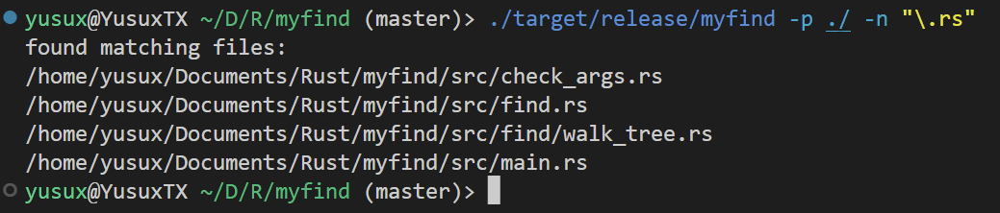
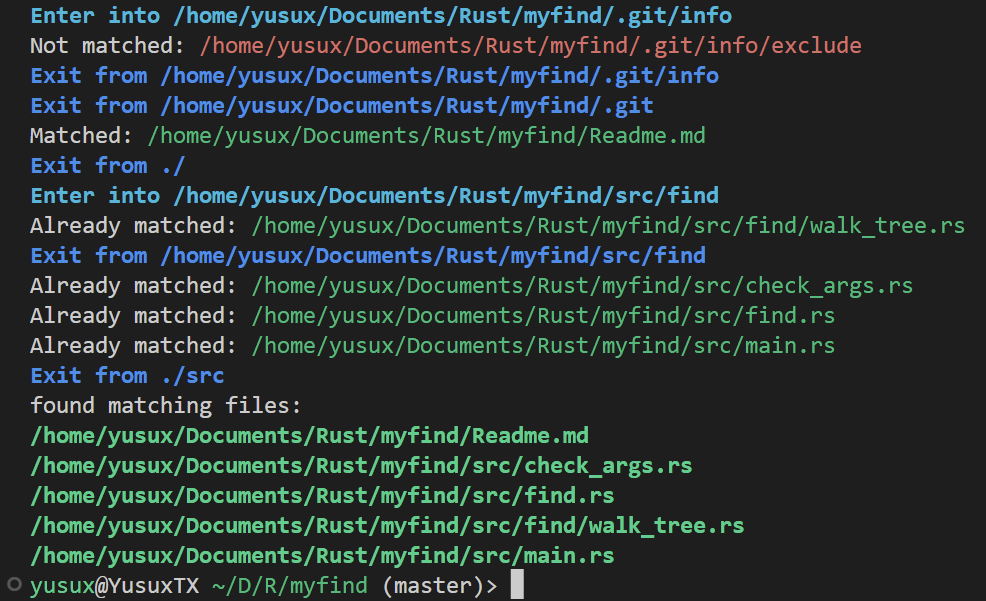
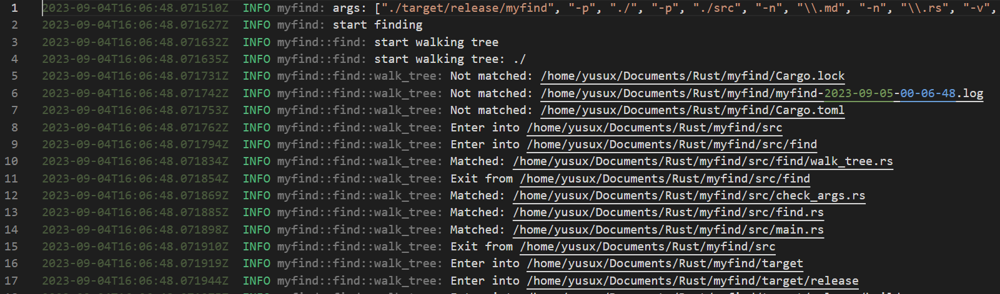

# MyFind For Rust

## 描述

这是使用 Rust 编写的一个简单的文件查找工具，可以根据一条或多条文件名的正则表达式在一条或多条路径进行查找，返回文件的绝对路径。可使用的参数如下：

``` shell
-n, --name <name>   # 使用正则表达式匹配文件名，如需匹配多个文件名，可使用多个 -n 参数，但至少需要一个 -n 参数
-p, --path <path>   # 指定查找的路径，如需查找多个路径，可使用多个 -p 参数，但至少需要一个 -p 参数
-v, --verbose       # 输出详细信息
-c, --color         # 输出带颜色的信息
-l, --log           # 输出信息到指定文件
```

## 使用

本项目使用 `cargo` 在 Linux 上进行管理，可使用 `cargo build --release` 进行编译，编译完成后可在 `target/release` 目录下找到可执行文件 `myfind`。

以查找当前目录下所有包含 `.rs` 的文件为例：

``` shell
./target/release/myfind -p ./ -n "\.rs"
```

输出如下图所示：



再以查找项目根目录和 `src` 目录下所有包含 `.md` 的文件和所有包含 `.rs` 的文件为例：

``` shell
./target/release/myfind -p ./ -p ./src -n "\.md" -n "\.rs" -v -c -l
```

部分输出如下图所示：



生成日志文件部分内容如下图所示：



> 由于采用 `std::collections::BTreeSet` 作为存储容器，因此输出的文件路径是有序且去重的。